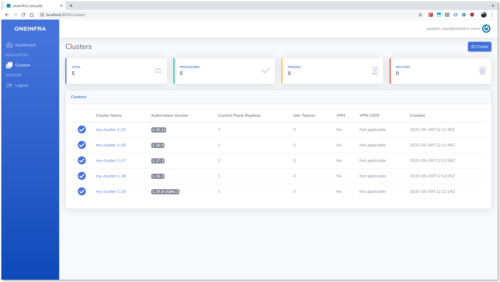
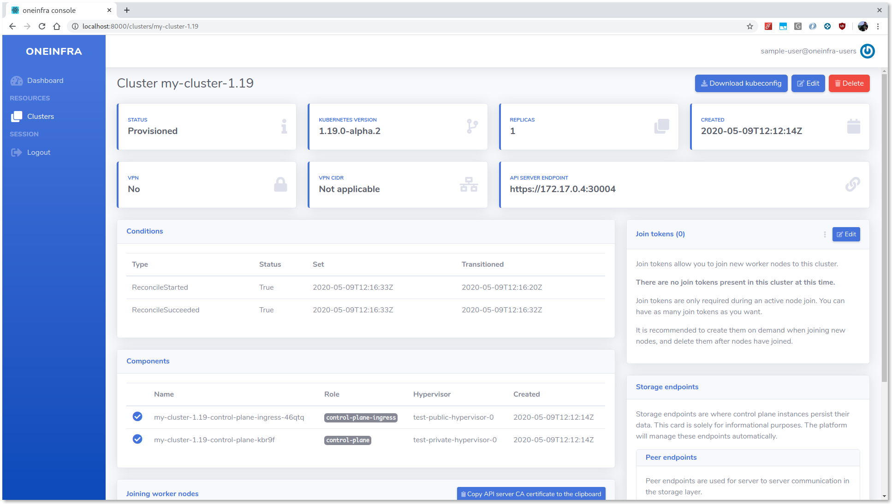

| Go Report                                                                                                                                      | Travis                                                                                                             | CircleCI                                                                                                             | Azure Test                                                                                                                                                                                    | Azure Release                                                                                                                                                                                       | License                                                                                                                              |
|------------------------------------------------------------------------------------------------------------------------------------------------|--------------------------------------------------------------------------------------------------------------------|----------------------------------------------------------------------------------------------------------------------|-----------------------------------------------------------------------------------------------------------------------------------------------------------------------------------------------|-----------------------------------------------------------------------------------------------------------------------------------------------------------------------------------------------------|--------------------------------------------------------------------------------------------------------------------------------------|
| [](https://goreportcard.com/report/github.com/oneinfra/oneinfra) | [](https://travis-ci.org/oneinfra/oneinfra) | [](https://circleci.com/gh/oneinfra/oneinfra) | [](https://dev.azure.com/oneinfra/oneinfra/_build/latest?definitionId=3&branchName=master) | [](https://dev.azure.com/oneinfra/oneinfra/_build/latest?definitionId=4&branchName=master) | [](https://opensource.org/licenses/Apache-2.0)|

# oneinfra

`oneinfra` is a Kubernetes as a Service platform. It empowers you to
provide or consume Kubernetes clusters at scale, on any platform or
service provider. You decide.

|                                               |                                                     |
|-----------------------------------------------|-----------------------------------------------------|
|  |  |

[Read more about its design here](docs/DESIGN.md).


## Managed Kubernetes versions

| Kubernetes version | Deployable with   | Default in        |                                                                                                                                                                            |                                                                                                                                                                             |
|--------------------|-------------------|-------------------|----------------------------------------------------------------------------------------------------------------------------------------------------------------------------|-----------------------------------------------------------------------------------------------------------------------------------------------------------------------------|
| `1.15.11`          | `20.05.0-alpha10` |                   | %20with%20local%20CRI%20endpoints)        | %20with%20remote%20CRI%20endpoints)        |
| `1.15.12`          | To be released    |                   | %20with%20local%20CRI%20endpoints)        | %20with%20remote%20CRI%20endpoints)        |
| `1.16.9`           | `20.05.0-alpha10` |                   | %20with%20local%20CRI%20endpoints)         | %20with%20remote%20CRI%20endpoints)         |
| `1.17.5`           | `20.05.0-alpha10` |                   | %20with%20local%20CRI%20endpoints)         | %20with%20remote%20CRI%20endpoints)         |
| `1.18.2`           | `20.05.0-alpha10` | `20.05.0-alpha10` | %20with%20local%20CRI%20endpoints)         | %20with%20remote%20CRI%20endpoints)         |
| `1.19.0-alpha.2`   | `20.05.0-alpha10` |                   | %20with%20local%20CRI%20endpoints) | %20with%20remote%20CRI%20endpoints) |
| `1.19.0-alpha.3`   | To be released    |                   | %20with%20local%20CRI%20endpoints) | %20with%20remote%20CRI%20endpoints) |


## Install

The `oneinfra` installation has several components:

* `oi`: `oneinfra` main CLI tool. This binary allows you to join new
  worker nodes, generate administrative kubeconfig files...

* `oi-local-hypervisor-set`: allows you to create fake hypervisors
  running as docker containers. This command is only meant to be used
  in test environments, never in production.

* `oi-manager` is `oneinfra`'s Kubernetes controller manager. The
  `oi-manager` is released as a container image and published in the
  Docker Hub.

* `oi-console` is `oneinfra`'s web console [living in a separate
  repository](https://github.com/oneinfra/console). The `oi-console`
  is released as a container image and published in the Docker Hub. It
  is optional to deploy.


### From released binaries

```console
$ wget -O oi https://github.com/oneinfra/oneinfra/releases/download/20.05.0-alpha10/oi-linux-amd64-20.05.0-alpha10
$ chmod +x oi
$ wget -O oi-local-hypervisor-set https://github.com/oneinfra/oneinfra/releases/download/20.05.0-alpha10/oi-local-hypervisor-set-linux-amd64-20.05.0-alpha10
$ chmod +x oi-local-hypervisor-set
```

You can now move these binaries to any place in your `$PATH`, or
execute them with their full path if you prefer.

As an alternative you can [install from source if you
prefer](docs/install-from-source.md).


## Quick start

For the quick start we will leverage Kubernetes as a management
cluster, but [you can also try `oneinfra` without the need of having
Kubernetes as a management cluster if you
prefer.](docs/quick-start-without-kubernetes.md)


### With Kubernetes as a management cluster

* Requirements
  * A Kubernetes cluster that will be the management cluster, where we
    will deploy the `oneinfra` controller manager
  * The `oneinfra` controller manager running in the management
    cluster needs to be able to reach the hypervisors you define
  * Docker, if you want to create fake local hypervisors using
    `oi-local-hypervisor-set`, or if you are going to use `kind`

1. Install kind and create the management cluster. If you already have
a Kubernetes cluster you can use, you can skip this step.

    ```console
    $ GO111MODULE="on" go get sigs.k8s.io/kind@v0.7.0
    ```

    **Important**: please, make sure that you have `kind` `v0.7.0`,
    and **not a newer version**. Anything newer than `v0.7.0` [won't
    work at this time due to this
    issue](https://github.com/oneinfra/oneinfra/issues/57) if you are
    using `oi-local-hypervisor-set` to create fake hypervisors.

    ```console
    $ kind create cluster
    ```

2. Deploy `cert-manager` and `oneinfra`.

    ```console
    $ kubectl apply --validate=false -f https://github.com/jetstack/cert-manager/releases/download/v0.14.1/cert-manager.yaml
    $ kubectl wait --for=condition=Available deployment --timeout=2m -n cert-manager --all
    $ kubectl apply -f https://raw.githubusercontent.com/oneinfra/oneinfra/20.05.0-alpha10/config/generated/all.yaml
    $ kubectl wait --for=condition=Available deployment --timeout=2m -n oneinfra-system --all
    ```

3. Create a local set of fake hypervisors, so `oneinfra` can schedule
managed control plane components. You can [also provision and define
your own set of hypervisors](docs/hypervisors.md) if you prefer.

    ```console
    $ oi-local-hypervisor-set create --tcp | kubectl apply -f -
    ```

    Note that `oi-local-hypervisor-set` **should not** be used to
    provision hypervisors for production environments -- this tool is
    just to easily test `oneinfra`. In production environments you
    will have to provision the hypervisors and define them as
    [described here](docs/hypervisors.md).


4. Create [as many managed clusters as you want using `oneinfra`
   API's](docs/quick-start-creating-managed-clusters.md). You can
   [also deploy the Web console](#deploy-the-web-console-optional)
   that will allow you to create clusters through an intuitive web
   interface.


## Deploy the Web console (optional)

`oneinfra` provides you a [simple web
console](https://github.com/oneinfra/console).

### Generate a JWT key for the Web console

You will have to create a JWT key that the console backend will use to
generate your JWT tokens when authenticating users. Let's do that:

```console
$ kubectl create secret generic -n oneinfra-system jwt-key --from-literal=jwt-key=$(cat /dev/urandom | tr -dc 'a-zA-Z0-9' | fold -w 64 | head -n 1)
```


### Kubernetes secrets as authentication mechanism

This is an only for testing authentication mechanism. Secrets inside a
namespace `oneinfra-users` resemble users.

```console
$ kubectl apply -f https://raw.githubusercontent.com/oneinfra/console/20.05.0-alpha2/config/generated/all-kubernetes-secrets.yaml
```

A user named `sample-user` with password `sample-user` has been
automatically created. Refer to the console inline help to learn how
to manage users with this authentication mechanism.

If you prefer to enable other authentication mechanisms that are
production ready, please [read the instructions
here](docs/web-console-oauth.md).


### Access the web console service

You can use any regular Kubernetes means to expose the web console
service; for ease of testing you can access it by using a port
forward:

```console
$ kubectl port-forward -n oneinfra-system svc/oneinfra-console 8000:80
```

You can now access the console by visiting `http://localhost:8000` in
your browser.


## Joining worker nodes to a managed cluster

You can read more details about the [worker joining process
here](docs/joining-worker-nodes.md).


## License

`oneinfra` is licensed under the terms of the Apache 2.0 license.

```
Copyright (C) 2020 Rafael Fernández López <ereslibre@ereslibre.es>

Licensed under the Apache License, Version 2.0 (the "License");
you may not use this file except in compliance with the License.
You may obtain a copy of the License at

   http://www.apache.org/licenses/LICENSE-2.0

Unless required by applicable law or agreed to in writing, software
distributed under the License is distributed on an "AS IS" BASIS,
WITHOUT WARRANTIES OR CONDITIONS OF ANY KIND, either express or implied.
See the License for the specific language governing permissions and
limitations under the License.
```
